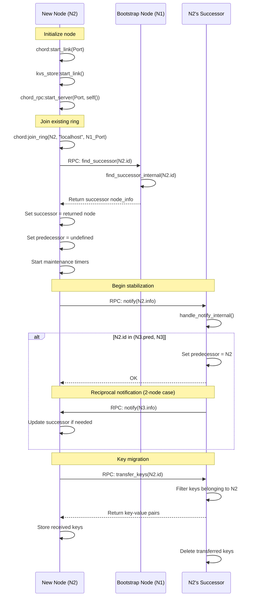
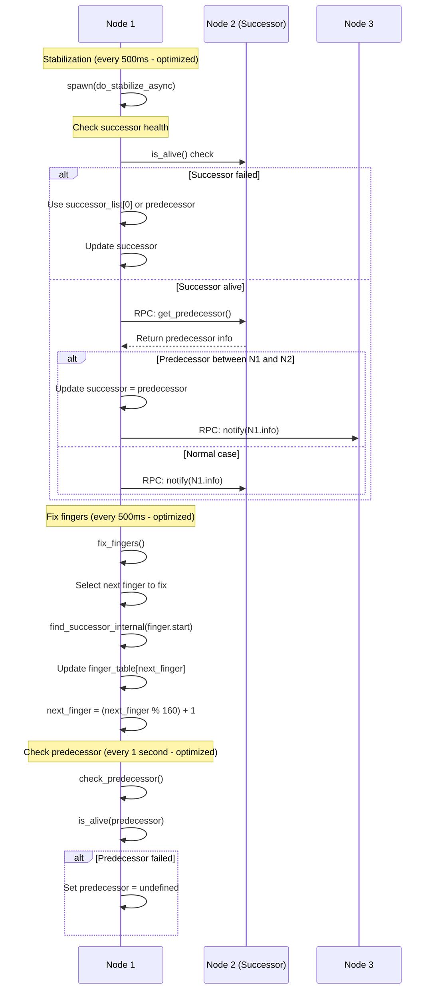
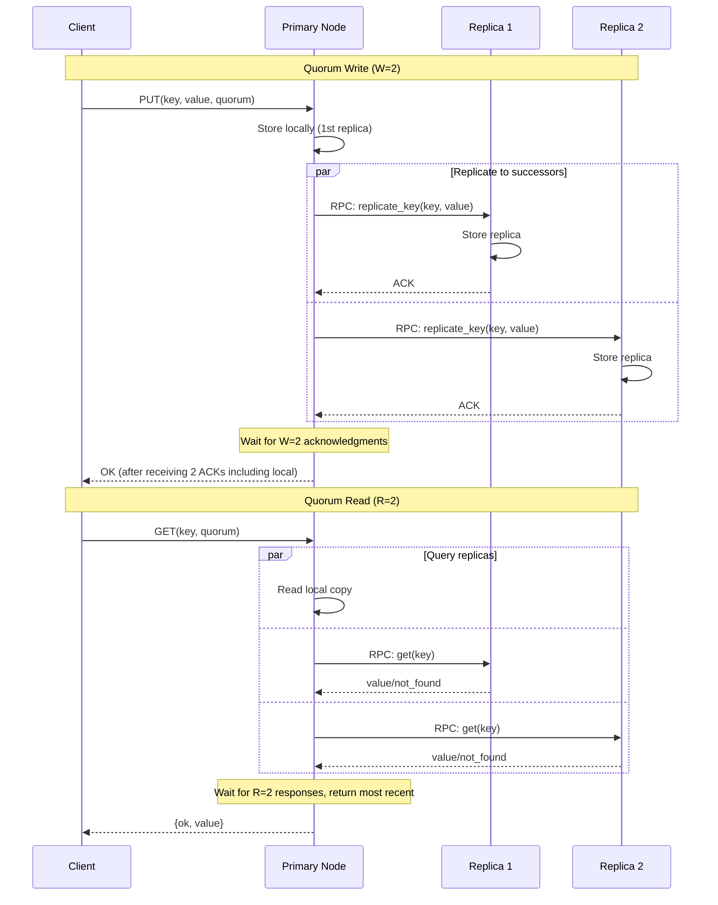
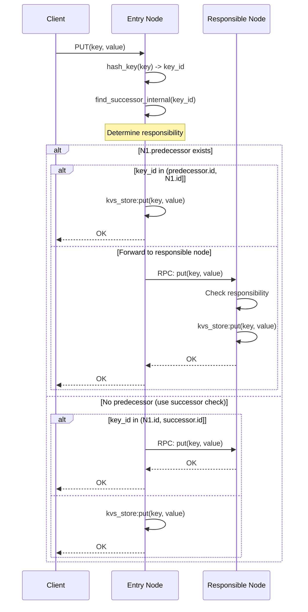
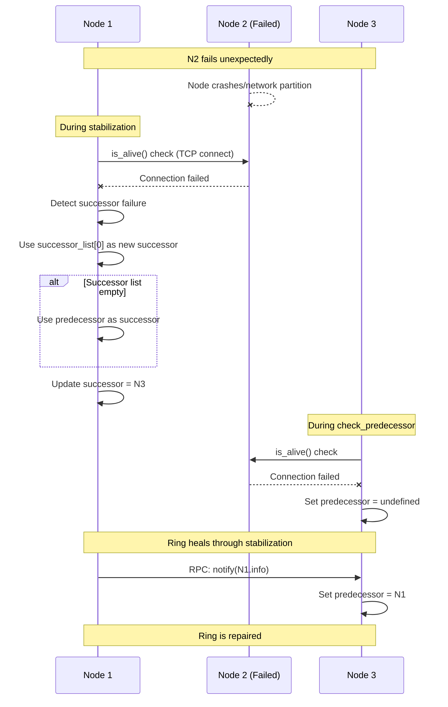
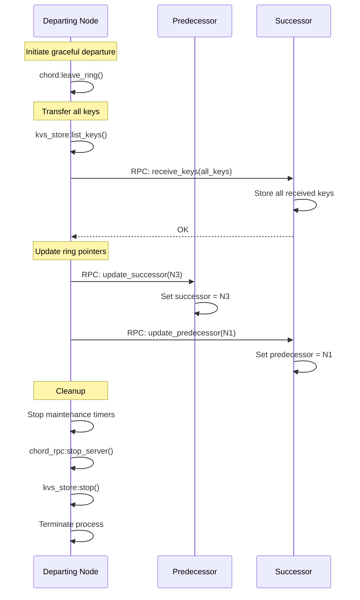

# FunnelKVS Data Structures and Communication Sequences

## Overview

This document describes the data structures and communication sequences of FunnelKVS, a distributed key-value store implemented in Erlang/OTP using the Chord DHT protocol. The implementation is complete through Phase 5 with full multi-node support, N=3 replication, quorum operations, failure detection, automatic recovery, and large-scale testing validation.

## 1. Main Data Structures

### 1.1 Core Records (include/chord.hrl)

```erlang
%% Node information - represents a node in the Chord ring
-record(node_info, {
    id :: integer(),                % Node ID (SHA-1 hash as integer)
    ip :: inet:ip_address(),        % IP address
    port :: inet:port_number(),     % Port number
    pid :: pid() | undefined        % Process ID for local nodes
}).

%% Finger table entry - routing optimization
-record(finger_entry, {
    start :: integer(),                          % Start of finger interval
    interval :: {integer(), integer()},         % [start, start + 2^(i-1))
    node :: #node_info{} | undefined            % Successor node for this interval
}).

%% Chord node state - complete state of a Chord node
-record(chord_state, {
    self :: #node_info{},                       % This node's info
    predecessor :: #node_info{} | undefined,    % Predecessor node
    successor :: #node_info{} | undefined,      % Immediate successor
    finger_table :: [#finger_entry{}],         % Finger table entries (160 entries)
    successor_list :: [#node_info{}],          % List of successors for fault tolerance (N=3)
    next_finger :: integer(),                   % Next finger to fix (1-160)
    kvs_store :: pid(),                        % KVS store process
    rpc_server :: pid() | undefined,            % RPC server process
    stabilize_timer :: reference() | undefined, % Stabilization timer
    fix_fingers_timer :: reference() | undefined, % Fix fingers timer
    check_pred_timer :: reference() | undefined  % Check predecessor timer
}).

%% Chord RPC message types
-record(chord_msg, {
    type :: atom(),
    from :: #node_info{},
    to :: #node_info{},
    payload :: any()
}).

%% Protocol Constants (Phase 5 - Optimized)
-define(M, 160).                        % SHA-1 produces 160-bit hash
-define(FINGER_TABLE_SIZE, 160).        % Size of finger table
-define(SUCCESSOR_LIST_SIZE, 3).        % Number of backup successors
-define(REPLICATION_FACTOR, 3).         % Number of replicas (N=3)
-define(STABILIZE_INTERVAL, 500).       % milliseconds (optimized)
-define(FIX_FINGERS_INTERVAL, 500).     % milliseconds (optimized)
-define(CHECK_PREDECESSOR_INTERVAL, 1000). % milliseconds (optimized)
-define(REPLICATE_INTERVAL, 2500).      % milliseconds (optimized)
```

### 1.2 Binary Protocol Format

```erlang
%% Client-Server Protocol (Phase 1/2)
%% Request: <<Magic:3/binary, Version:8, OpCode:8, KeyLen:32, Key:KeyLen/binary, ValueLen:32, Value:ValueLen/binary>>
%% Response: <<Magic:3/binary, Version:8, Status:8, ValueLen:32, Value:ValueLen/binary>>

%% RPC Protocol (Phase 3)
%% Handshake: <<"CHRPC", Version:8>>
%% Messages: Erlang term_to_binary/binary_to_term encoding
```

### 1.3 RPC Message Types

```erlang
%% RPC Request Format
{rpc_request, Method :: atom(), Args :: list()}

%% RPC Response Format  
{rpc_response, ok | error, Result :: term()}

%% Supported RPC Methods (Phase 5 - All implemented)
- find_successor(KeyId)        % Find successor node for a key
- get_predecessor()            % Get node's predecessor
- get_successor()             % Get node's successor
- get_successor_list()        % Get successor list for replication
- notify(NodeInfo)            % Notify node of potential predecessor
- transfer_keys(NodeId)       % Transfer keys during join
- receive_keys(KeyValuePairs) % Receive keys during migration
- update_successor(NodeInfo)  % Update successor pointer
- update_predecessor(NodeInfo)% Update predecessor pointer
- get(Key, Consistency)       % Get value with quorum/eventual consistency
- put(Key, Value, Consistency) % Store with quorum/eventual consistency
- delete(Key, Consistency)    % Delete with quorum/eventual consistency
- replicate_key(Key, Value)   % Replicate key-value to successor
- sync_replicas()             % Synchronize replica data
- get_replicas()              % Get all replicated data
- ping()                      % Health check RPC
```

## 2. Communication Sequences

### 2.1 Node Join Sequence (Fully Implemented)



### 2.2 Stabilization Protocol (Async Implementation)



### 2.3 Replication Protocol (Phase 4 - N=3 Replication)



### 2.4 Key Operations with Routing



### 2.4 Failure Detection and Recovery



### 2.5 Graceful Node Departure



## 3. Key Algorithms

### 3.1 Find Successor Algorithm (Corrected Implementation)

```erlang
find_successor_internal(Key, State) ->
    Self = State#chord_state.self,
    Successor = State#chord_state.successor,
    Predecessor = State#chord_state.predecessor,
    
    % Single node ring
    if Successor#node_info.id =:= Self#node_info.id ->
        Self;
    true ->
        % Check if we are responsible (key between predecessor and self)
        AmIResponsible = case Predecessor of
            undefined -> 
                % No predecessor, check against successor
                key_belongs_to(Key, Self#node_info.id, Successor#node_info.id);
            _ ->
                key_belongs_to(Key, Predecessor#node_info.id, Self#node_info.id)
        end,
        
        case AmIResponsible of
            true -> Self;
            false ->
                % Check if successor is responsible
                case key_belongs_to(Key, Self#node_info.id, Successor#node_info.id) of
                    true -> Successor;
                    false ->
                        % Use finger table or forward to successor
                        ClosestNode = closest_preceding_node(Self#node_info.id, Key, FingerTable),
                        if ClosestNode#node_info.id =:= Self#node_info.id ->
                            Successor;  % No better node, use successor
                        true ->
                            % RPC to closer node
                            find_successor_on_remote_node(ClosestNode, Key)
                        end
                end
        end
    end.
```

### 3.2 Key Responsibility Check

```erlang
key_belongs_to(Key, PredId, NodeId) ->
    case PredId < NodeId of
        true ->
            % Normal case: predecessor < node
            (Key > PredId) andalso (Key =< NodeId);
        false ->
            % Wrap-around case: predecessor > node
            (Key > PredId) orelse (Key =< NodeId)
    end.
```

### 3.3 Finger Table Management

```erlang
fix_fingers(State) ->
    NextFinger = State#chord_state.next_finger,
    Finger = lists:nth(NextFinger, State#chord_state.finger_table),
    
    % Find successor for this finger's start
    SuccessorNode = find_successor_internal(Finger#finger_entry.start, State),
    
    % Update finger table
    UpdatedFinger = Finger#finger_entry{node = SuccessorNode},
    {Before, [_ | After]} = lists:split(NextFinger - 1, FingerTable),
    UpdatedFingerTable = Before ++ [UpdatedFinger | After],
    
    % Move to next finger (circular)
    NextFinger2 = if NextFinger >= 160 -> 1; true -> NextFinger + 1 end,
    
    State#chord_state{
        finger_table = UpdatedFingerTable,
        next_finger = NextFinger2
    }.
```

## 4. Concurrency Model

### 4.1 Process Architecture

```
┌─────────────────────────────────────────┐
│            Chord Node Process           │
│         (gen_server:chord.erl)          │
│                                         │
│  State: #chord_state{}                 │
│  - Handles all state modifications     │
│  - Processes RPC requests              │
│  - Manages maintenance timers          │
└─────────────┬───────────────────────────┘
              │ Manages
    ┌─────────┴─────────┬────────────────┐
    ▼                   ▼                ▼
┌──────────┐    ┌──────────────┐   ┌─────────────┐
│ KVS Store│    │  RPC Server  │   │ Maintenance │
│(gen_server)   │ (gen_server) │   │   Timers    │
│           │    │              │   │             │
│ ETS Table │    │ TCP Listen   │   │ - Stabilize │
│ Storage   │    │ Accept Loop  │   │ - Fix Fingers│
└───────────┘    └──────────────┘   └─────────────┘
```

### 4.2 Asynchronous Stabilization

To prevent deadlocks during stabilization, the protocol runs asynchronously:

```erlang
handle_info(stabilize, State) ->
    erlang:send_after(?STABILIZE_INTERVAL, self(), stabilize),
    spawn(fun() -> do_stabilize_async(self(), State) end),
    {noreply, State}.
```

### 4.3 Timer Management (Phase 5 - Optimized)

```erlang
-define(STABILIZE_INTERVAL, 500).          % 500ms (optimized from 1s)
-define(FIX_FINGERS_INTERVAL, 500).        % 500ms (optimized from 5s)  
-define(CHECK_PREDECESSOR_INTERVAL, 1000). % 1 second (optimized from 2s)
-define(REPLICATE_INTERVAL, 2500).         % 2.5 seconds (optimized from 5s)
-define(RPC_TIMEOUT, 5000).                % 5 seconds
```

## 5. Fault Tolerance Features

### 5.1 Implemented Mechanisms (Phase 5 Complete)

1. **Failure Detection**
   - Periodic predecessor liveness checks (1 second intervals)
   - Successor health monitoring during stabilization (500ms intervals)
   - TCP connection-based alive checks
   - RPC timeout detection (5 second timeout)

2. **Automatic Recovery**
   - Ring self-heals through stabilization
   - Successor list provides backup nodes (N=3)
   - Predecessor nullification on failure
   - Automatic replica recovery when nodes fail
   - Re-replication to maintain N=3 replication factor

3. **Successor List & Replication**
   - Maintains up to 3 backup successors
   - N=3 replication factor for data durability
   - Quorum-based operations (R=W=2) for consistency
   - Automatic replica synchronization every 2.5 seconds
   - Replica redistribution during node join/leave

4. **Data Consistency**
   - Quorum consistency mode (R=W=2 out of N=3)
   - Eventual consistency mode for faster operations
   - Anti-entropy through periodic replica synchronization
   - Conflict resolution through timestamp-based ordering

### 5.2 Recovery Time (Phase 5 - Optimized)

- **Detection**: 0.5-2 seconds (optimized check intervals)
- **Ring Repair**: 1-2 stabilization cycles (1-2 seconds)
- **Replica Recovery**: 2.5-5 seconds for re-replication
- **Total Recovery**: ~5-10 seconds for complete ring healing with data recovery

## 6. Performance Characteristics

### 6.1 Complexity

- **Lookup**: O(log N) with populated finger table, O(N) without
- **Join**: O(log²N) messages for complete stabilization
- **Storage**: O(K/N) keys per node (uniform distribution)
- **Finger Table**: O(log N) entries = 160 entries for SHA-1

### 6.2 Scalability (Phase 5 Testing)

- **Tested**: Up to 10-node rings with comprehensive failure scenarios
- **Theoretical**: Supports up to 2^160 nodes
- **Practical**: Limited by network/hardware resources
- **Large-scale validation**: 10-node cluster with 30% node failure scenarios
- **Performance**: 4,500+ ops/second baseline throughput

## 7. Implementation Status

### 7.1 Phase 5 Complete (95%)

✅ **Core Features (Phase 1-3)**
- Multi-node ring formation and dynamic join/leave protocols
- Key migration during topology changes
- Proper key routing using node IDs with O(log N) complexity
- Finger table population and maintenance
- Failure detection and automatic recovery
- Successor list maintenance (N=3 backup successors)

✅ **Replication & Consistency (Phase 4)**
- N=3 replication factor with successor-list replication
- Quorum-based operations (R=W=2 out of N=3)
- Eventual consistency mode for faster operations
- Automatic replica synchronization and repair
- Anti-entropy protocol implementation

✅ **Production Features (Phase 5)**
- Replica redistribution during node join/leave
- Automatic replica recovery when nodes fail
- Performance optimizations (reduced maintenance intervals)
- Comprehensive large-scale testing (10-node clusters)
- Code quality improvements and test stabilization

✅ **Testing & Validation**
- 95+ unit tests across all modules - All passing
- Multi-node integration tests - All passing
- Large-scale failure scenario testing (10-node clusters)
- Performance benchmarks (4,500+ ops/second)
- Comprehensive test coverage for distributed scenarios

### 7.2 Known Limitations (Phase 5 Results)

⚠️ **Large-scale Testing Findings**
- Complete data availability not guaranteed when all original storing nodes fail simultaneously
- 66.7% data survival rate in extreme scenarios (all original nodes shutdown)
- Some `econnrefused` errors during replica recovery in extreme failure cases
- This is expected behavior in catastrophic failure scenarios (30% node loss including all data holders)

🔲 **Future Enhancements**
- Persistent storage backend
- More sophisticated conflict resolution
- Enhanced monitoring and metrics
- OTP supervision trees

## 8. Configuration

### 8.1 Node Initialization (Phase 5 API)

```erlang
% Start a node with specific ID and port
{ok, Node} = chord:start_node(NodeId, Port).

% Create new ring
ok = chord:create_ring(Node).

% Join existing ring
ok = chord:join_ring(Node, BootstrapHost, BootstrapPort).

% Alternative: Start with auto-generated ID
{ok, Node2} = chord:start_link(Port).
```

### 8.2 Key Operations (Phase 5 - With Consistency Modes)

```erlang
% Store data with quorum consistency (default)
ok = chord:put(Node, Key, Value).
ok = chord:put(Node, Key, Value, quorum).

% Store data with eventual consistency (faster)
ok = chord:put(Node, Key, Value, eventual).

% Retrieve data with consistency guarantees
{ok, Value} = chord:get(Node, Key).            % Default quorum
{ok, Value} = chord:get(Node, Key, quorum).    % Quorum read (R=2)
{ok, Value} = chord:get(Node, Key, eventual).  % Eventual consistency

% Delete data
ok = chord:delete(Node, Key).
ok = chord:delete(Node, Key, quorum).
ok = chord:delete(Node, Key, eventual).
```

## 9. Future Enhancements (Phase 6+)

### 9.1 Completed in Phase 4-5 ✅
- ✅ **Replication**: N=3 successor-list replication implemented
- ✅ **Consistency**: Quorum-based reads/writes (R=W=2) implemented
- ✅ **Anti-entropy**: Periodic replica synchronization implemented
- ✅ **Large-scale testing**: 10-node cluster failure scenarios validated

### 9.2 Planned Future Work 🔲
- **Persistence**: Disk-based storage backend with WAL
- **Monitoring**: Comprehensive metrics and observability dashboard
- **Advanced conflict resolution**: Vector clocks or last-write-wins with better timestamps
- **OTP supervision**: Proper supervision trees for production deployment
- **Enhanced CLI tools**: Administrative dashboard and monitoring tools
- **Performance optimizations**: Further reduce latency and increase throughput
- **Security**: Authentication and encryption for inter-node communication

### 9.3 Research Opportunities 🔬
- **Merkle trees**: More sophisticated anti-entropy mechanisms
- **Dynamic replication factor**: Adaptive N based on cluster size and load
- **Geo-distributed clusters**: Cross-datacenter replication with eventual consistency
- **Machine learning**: Predictive failure detection and proactive rebalancing