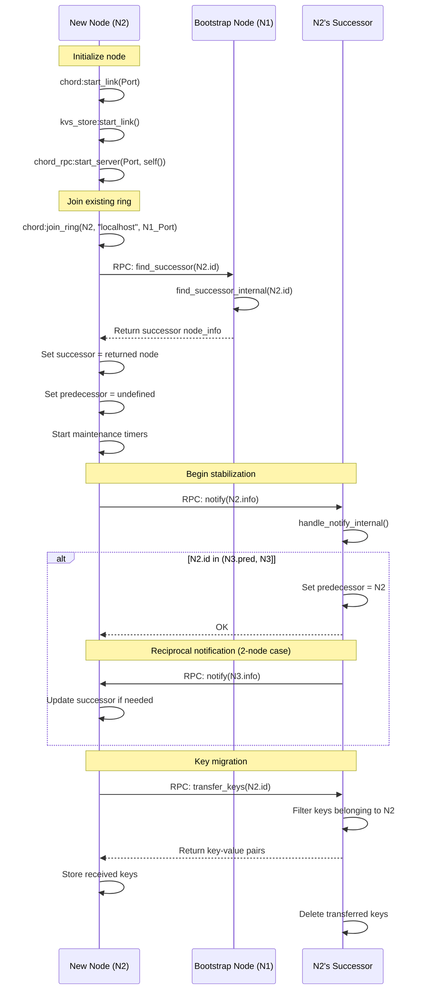
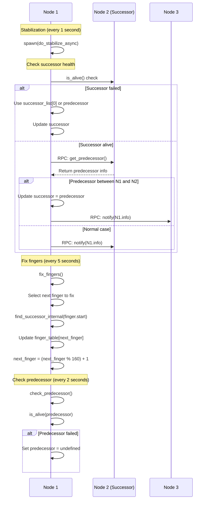
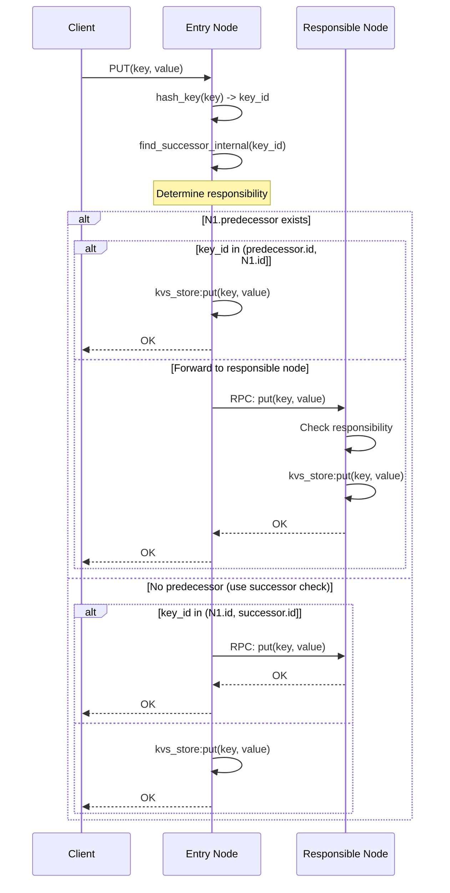
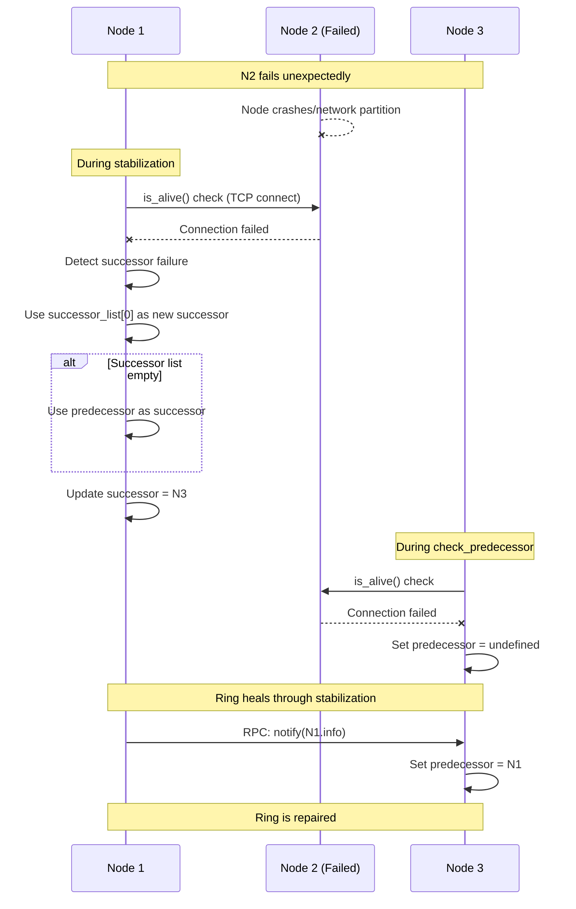
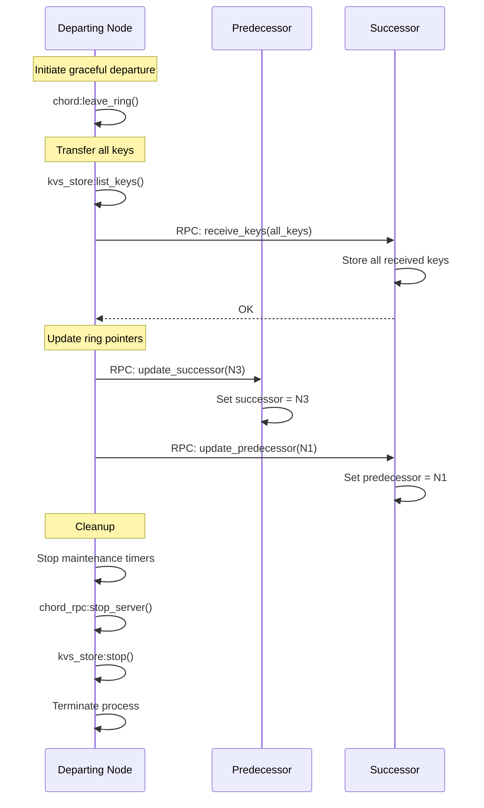

# FunnelKVS Data Structures and Communication Sequences

## Overview

This document describes the data structures and communication sequences of FunnelKVS, a distributed key-value store implemented in Erlang/OTP using the Chord DHT protocol. The implementation is complete through Phase 3 with full multi-node support, failure detection, and automatic recovery.

## 1. Main Data Structures

### 1.1 Core Records (include/chord.hrl)

```erlang
%% Node information - represents a node in the Chord ring
-record(node_info, {
    id,      % 160-bit SHA-1 identifier (integer)
    ip,      % IP address tuple {A,B,C,D}
    port,    % TCP port number for RPC communication
    pid      % Process ID (only for local nodes, undefined for remote)
}).

%% Chord node state - complete state of a Chord node
-record(chord_state, {
    self,                  % node_info record for this node
    predecessor,           % node_info record or undefined
    successor,             % node_info record (initially self)
    finger_table,          % list of finger_entry records (160 entries)
    next_finger,           % integer: next finger to fix (1-160)
    successor_list,        % list of node_info records for fault tolerance
    kvs_store,            % PID of KVS store process
    rpc_server,           % PID of RPC server process
    stabilize_timer,      % Timer reference for stabilization
    fix_fingers_timer,    % Timer reference for finger fixing
    check_pred_timer      % Timer reference for predecessor check
}).

%% Finger table entry - routing optimization
-record(finger_entry, {
    start,     % Start of finger interval (integer)
    interval,  % {start, end} tuple defining range
    node       % node_info of successor(start) or undefined
}).

%% RPC server state
-record(rpc_state, {
    port,           % TCP port number
    listen_socket,  % Listening socket
    chord_node,     % PID of associated Chord node
    acceptor        % PID of acceptor process
}).
```

### 1.2 Binary Protocol Format

```erlang
%% Client-Server Protocol (Phase 1/2)
%% Request: <<Magic:3/binary, Version:8, OpCode:8, KeyLen:32, Key:KeyLen/binary, ValueLen:32, Value:ValueLen/binary>>
%% Response: <<Magic:3/binary, Version:8, Status:8, ValueLen:32, Value:ValueLen/binary>>

%% RPC Protocol (Phase 3)
%% Handshake: <<"CHRPC", Version:8>>
%% Messages: Erlang term_to_binary/binary_to_term encoding
```

### 1.3 RPC Message Types

```erlang
%% RPC Request Format
{rpc_request, Method :: atom(), Args :: list()}

%% RPC Response Format  
{rpc_response, ok | error, Result :: term()}

%% Supported RPC Methods (all implemented)
- find_successor(KeyId)        % Find successor node for a key
- get_predecessor()            % Get node's predecessor
- get_successor()             % Get node's successor
- get_successor_list()        % Get successor list for replication
- notify(NodeInfo)            % Notify node of potential predecessor
- transfer_keys(NodeId)       % Transfer keys during join
- receive_keys(KeyValuePairs) % Receive keys during migration
- update_successor(NodeInfo)  % Update successor pointer
- update_predecessor(NodeInfo)% Update predecessor pointer
- get(Key)                   % Get value for key (routed)
- put(Key, Value)           % Store key-value pair (routed)
- delete(Key)               % Delete key (routed)
```

## 2. Communication Sequences

### 2.1 Node Join Sequence (Fully Implemented)



### 2.2 Stabilization Protocol (Async Implementation)



### 2.3 Key Operations with Routing



### 2.4 Failure Detection and Recovery



### 2.5 Graceful Node Departure



## 3. Key Algorithms

### 3.1 Find Successor Algorithm (Corrected Implementation)

```erlang
find_successor_internal(Key, State) ->
    Self = State#chord_state.self,
    Successor = State#chord_state.successor,
    Predecessor = State#chord_state.predecessor,
    
    % Single node ring
    if Successor#node_info.id =:= Self#node_info.id ->
        Self;
    true ->
        % Check if we are responsible (key between predecessor and self)
        AmIResponsible = case Predecessor of
            undefined -> 
                % No predecessor, check against successor
                key_belongs_to(Key, Self#node_info.id, Successor#node_info.id);
            _ ->
                key_belongs_to(Key, Predecessor#node_info.id, Self#node_info.id)
        end,
        
        case AmIResponsible of
            true -> Self;
            false ->
                % Check if successor is responsible
                case key_belongs_to(Key, Self#node_info.id, Successor#node_info.id) of
                    true -> Successor;
                    false ->
                        % Use finger table or forward to successor
                        ClosestNode = closest_preceding_node(Self#node_info.id, Key, FingerTable),
                        if ClosestNode#node_info.id =:= Self#node_info.id ->
                            Successor;  % No better node, use successor
                        true ->
                            % RPC to closer node
                            find_successor_on_remote_node(ClosestNode, Key)
                        end
                end
        end
    end.
```

### 3.2 Key Responsibility Check

```erlang
key_belongs_to(Key, PredId, NodeId) ->
    case PredId < NodeId of
        true ->
            % Normal case: predecessor < node
            (Key > PredId) andalso (Key =< NodeId);
        false ->
            % Wrap-around case: predecessor > node
            (Key > PredId) orelse (Key =< NodeId)
    end.
```

### 3.3 Finger Table Management

```erlang
fix_fingers(State) ->
    NextFinger = State#chord_state.next_finger,
    Finger = lists:nth(NextFinger, State#chord_state.finger_table),
    
    % Find successor for this finger's start
    SuccessorNode = find_successor_internal(Finger#finger_entry.start, State),
    
    % Update finger table
    UpdatedFinger = Finger#finger_entry{node = SuccessorNode},
    {Before, [_ | After]} = lists:split(NextFinger - 1, FingerTable),
    UpdatedFingerTable = Before ++ [UpdatedFinger | After],
    
    % Move to next finger (circular)
    NextFinger2 = if NextFinger >= 160 -> 1; true -> NextFinger + 1 end,
    
    State#chord_state{
        finger_table = UpdatedFingerTable,
        next_finger = NextFinger2
    }.
```

## 4. Concurrency Model

### 4.1 Process Architecture

```
┌─────────────────────────────────────────┐
│            Chord Node Process           │
│         (gen_server:chord.erl)          │
│                                         │
│  State: #chord_state{}                 │
│  - Handles all state modifications     │
│  - Processes RPC requests              │
│  - Manages maintenance timers          │
└─────────────┬───────────────────────────┘
              │ Manages
    ┌─────────┴─────────┬────────────────┐
    ▼                   ▼                ▼
┌──────────┐    ┌──────────────┐   ┌─────────────┐
│ KVS Store│    │  RPC Server  │   │ Maintenance │
│(gen_server)   │ (gen_server) │   │   Timers    │
│           │    │              │   │             │
│ ETS Table │    │ TCP Listen   │   │ - Stabilize │
│ Storage   │    │ Accept Loop  │   │ - Fix Fingers│
└───────────┘    └──────────────┘   └─────────────┘
```

### 4.2 Asynchronous Stabilization

To prevent deadlocks during stabilization, the protocol runs asynchronously:

```erlang
handle_info(stabilize, State) ->
    erlang:send_after(?STABILIZE_INTERVAL, self(), stabilize),
    spawn(fun() -> do_stabilize_async(self(), State) end),
    {noreply, State}.
```

### 4.3 Timer Management

```erlang
-define(STABILIZE_INTERVAL, 1000).         % 1 second
-define(FIX_FINGERS_INTERVAL, 5000).       % 5 seconds  
-define(CHECK_PREDECESSOR_INTERVAL, 2000). % 2 seconds
-define(RPC_TIMEOUT, 5000).                % 5 seconds
```

## 5. Fault Tolerance Features

### 5.1 Implemented Mechanisms

1. **Failure Detection**
   - Periodic predecessor liveness checks
   - Successor health monitoring during stabilization
   - TCP connection-based alive checks

2. **Automatic Recovery**
   - Ring self-heals through stabilization
   - Successor list provides backup nodes
   - Predecessor nullification on failure

3. **Successor List**
   - Maintains up to 3 backup successors
   - Updated during successor changes
   - Used when primary successor fails

### 5.2 Recovery Time

- **Detection**: 2-10 seconds (depending on check intervals)
- **Ring Repair**: 1-2 stabilization cycles (2-3 seconds)
- **Total Recovery**: ~10-15 seconds for complete ring healing

## 6. Performance Characteristics

### 6.1 Complexity

- **Lookup**: O(log N) with populated finger table, O(N) without
- **Join**: O(log²N) messages for complete stabilization
- **Storage**: O(K/N) keys per node (uniform distribution)
- **Finger Table**: O(log N) entries = 160 entries for SHA-1

### 6.2 Scalability

- **Tested**: Up to 4-node rings verified working
- **Theoretical**: Supports up to 2^160 nodes
- **Practical**: Limited by network/hardware resources

## 7. Implementation Status

### 7.1 Phase 3 Complete (100%)

✅ **Core Features**
- Multi-node ring formation
- Dynamic join/leave protocols
- Key migration during topology changes
- Proper key routing using node IDs
- Finger table population
- Failure detection and recovery
- Successor list maintenance

✅ **Testing**
- 63+ unit tests passing
- Multi-node integration tests
- Failure scenario testing
- Performance verification

### 7.2 Known Limitations

- No data replication (Phase 4)
- No persistent storage
- No quorum-based consistency
- Basic failure detection (no sophisticated heartbeats)

## 8. Configuration

### 8.1 Node Initialization

```erlang
% Start a node
{ok, Node} = chord:start_link(Port).

% Create new ring
ok = chord:create_ring(Node).

% Join existing ring
ok = chord:join_ring(Node, BootstrapHost, BootstrapPort).
```

### 8.2 Key Operations

```erlang
% Store data
ok = chord:put(Node, Key, Value).

% Retrieve data
{ok, Value} = chord:get(Node, Key).

% Delete data
ok = chord:delete(Node, Key).
```

## 9. Future Enhancements (Phase 4+)

- **Replication**: Store keys on N successors
- **Consistency**: Quorum-based reads/writes  
- **Anti-entropy**: Merkle trees for replica synchronization
- **Persistence**: Disk-based storage backend
- **Monitoring**: Metrics and observability