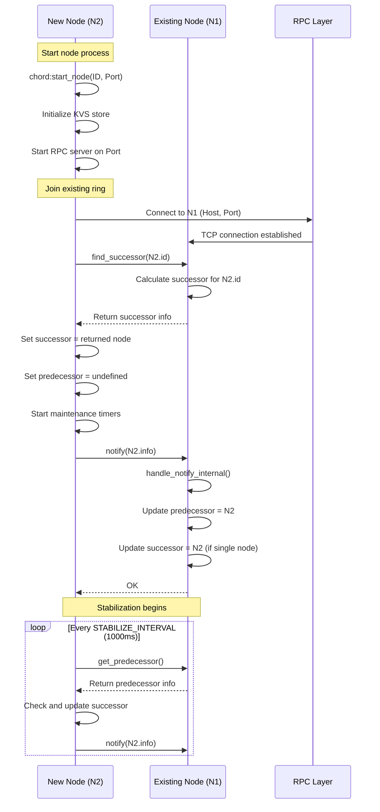
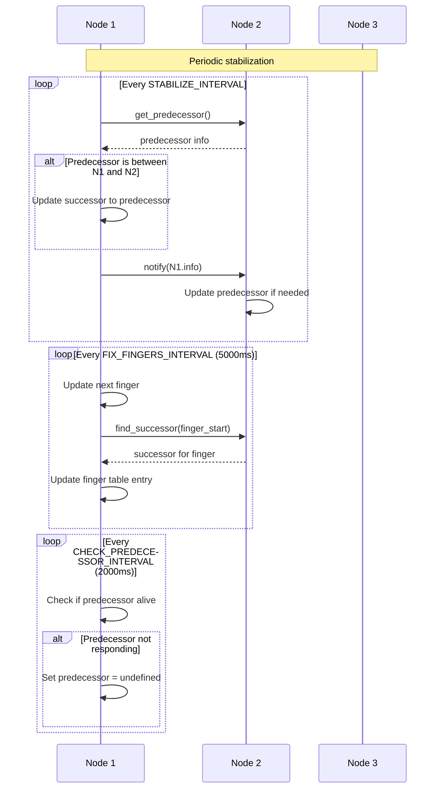
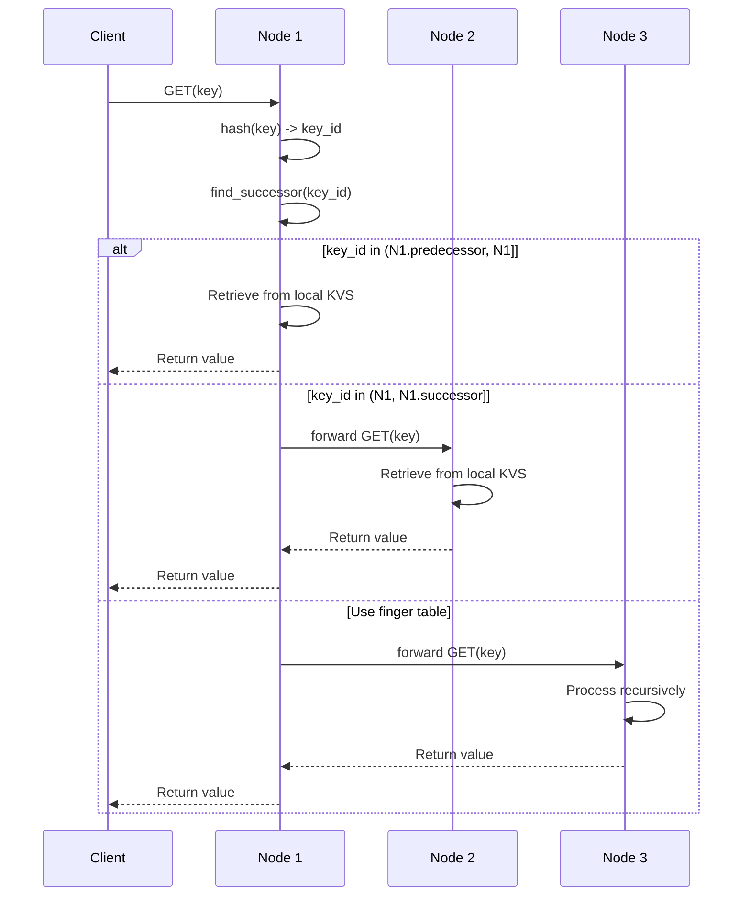
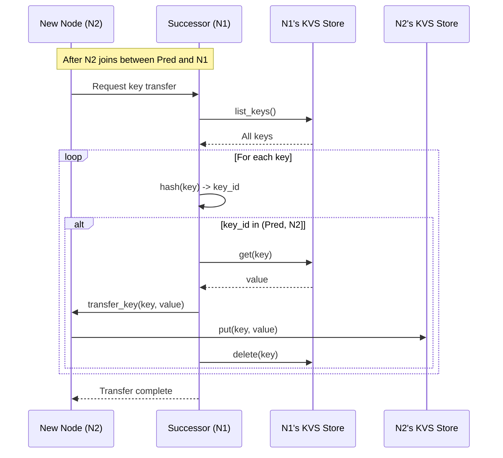
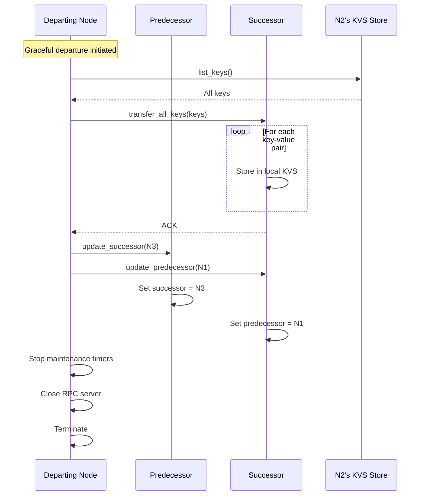
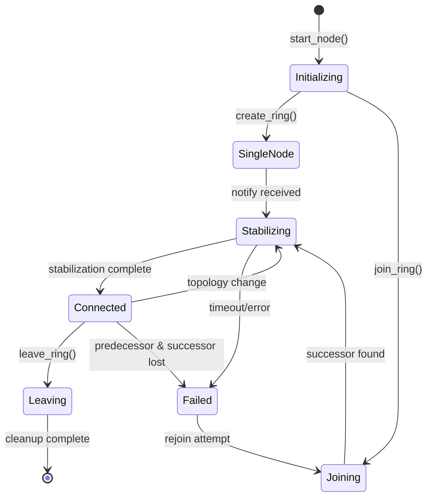
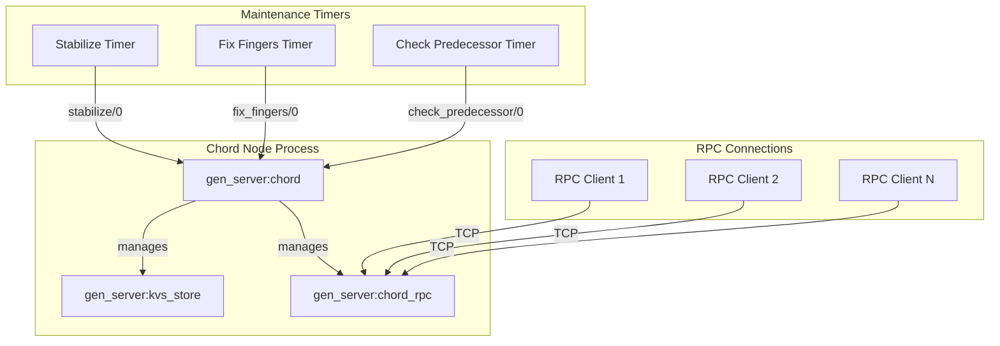

# FunnelKVS Design Document - Phase 3

## Overview

This document describes the design and implementation of FunnelKVS at Phase 3, focusing on the Chord DHT protocol implementation, inter-node communication, and distributed key-value storage mechanisms.

## 1. Chord Protocol Communication Sequences

### 1.1 Node Join Sequence



### 1.2 Ring Stabilization Sequence



### 1.3 Key Lookup Sequence



## 2. Data Migration Sequences

### 2.1 Key Transfer on Node Join



### 2.2 Key Transfer on Node Departure



## 3. Main Data Structures

### 3.1 Core Records

```erlang
%% Node information
-record(node_info, {
    id,      % 160-bit SHA-1 identifier
    ip,      % IP address tuple {A,B,C,D}
    port,    % TCP port number
    pid      % Process ID (for local nodes)
}).

%% Chord node state
-record(chord_state, {
    self,                  % node_info record
    predecessor,           % node_info record or undefined
    successor,             % node_info record
    finger_table,          % array of node_info records
    next_finger,           % integer: next finger to fix
    successor_list,        % list of node_info records
    kvs_store,            % PID of KVS store process
    rpc_server,           % PID of RPC server process
    stabilize_timer,      % Timer reference
    fix_fingers_timer,    % Timer reference
    check_pred_timer      % Timer reference
}).

%% Finger table entry
-record(finger, {
    start,     % Start of finger interval
    interval,  % {start, end} tuple
    node       % node_info of successor(start)
}).
```

### 3.2 RPC Message Format

```erlang
%% RPC Request
{rpc_request, Method :: atom(), Args :: list()}

%% RPC Response  
{ok, Result} | {error, Reason}

%% Supported RPC Methods
- find_successor(KeyId)
- get_predecessor()
- get_successor()
- notify(NodeInfo)
- transfer_keys(KeyValuePairs)
- get(Key)
- put(Key, Value)
- delete(Key)
```

### 3.3 Protocol State Machine



## 4. Concurrency and Synchronization

### 4.1 Process Architecture



### 4.2 Concurrency Model

#### Process Isolation
- Each Chord node runs as an independent `gen_server` process
- KVS store is a separate `gen_server` process per node
- RPC server handles concurrent connections in separate processes
- No shared memory between nodes - all communication via message passing

#### Message Ordering
- All state modifications go through the `gen_server` call/cast mechanism
- Serialized message processing ensures consistency
- No race conditions on state updates within a single node

#### Asynchronous Operations
- Maintenance operations (stabilize, fix_fingers) run asynchronously
- RPC calls have timeouts (default 5000ms) to prevent deadlocks
- Background timers use `erlang:send_after/3` for scheduling

### 4.3 Synchronization Mechanisms

#### State Synchronization
```erlang
%% All state changes serialized through gen_server
handle_call({update_successor, NewSucc}, _From, State) ->
    NewState = State#chord_state{successor = NewSucc},
    {reply, ok, NewState};

handle_call({update_predecessor, NewPred}, _From, State) ->
    NewState = State#chord_state{predecessor = NewPred},
    {reply, ok, NewState}.
```

#### RPC Synchronization
```erlang
%% RPC calls are synchronous with timeout
chord_rpc:call(Socket, Method, Args, Timeout) ->
    %% Send request
    Request = encode_request(Method, Args),
    gen_tcp:send(Socket, Request),
    
    %% Wait for response with timeout
    receive
        {tcp, Socket, Data} ->
            decode_response(Data)
    after Timeout ->
        {error, timeout}
    end.
```

#### Timer Management
```erlang
%% Timers are cancelled before updates
stop_maintenance_timers(#chord_state{
    stabilize_timer = ST,
    fix_fingers_timer = FFT,
    check_pred_timer = CPT
}) ->
    cancel_timer(ST),
    cancel_timer(FFT),
    cancel_timer(CPT).

%% New timers started atomically
start_maintenance_timers(State) ->
    StabilizeTimer = erlang:send_after(?STABILIZE_INTERVAL, self(), stabilize),
    FixFingersTimer = erlang:send_after(?FIX_FINGERS_INTERVAL, self(), fix_fingers),
    CheckPredTimer = erlang:send_after(?CHECK_PREDECESSOR_INTERVAL, self(), check_predecessor),
    
    State#chord_state{
        stabilize_timer = StabilizeTimer,
        fix_fingers_timer = FixFingersTimer,
        check_pred_timer = CheckPredTimer
    }.
```

### 4.4 Mutual Exclusion

#### Node-Level Exclusion
- Each node's state is protected by `gen_server` serialization
- No explicit locks needed - Erlang's actor model provides isolation
- Critical sections are naturally atomic within a single `handle_call/3`

#### Ring-Level Coordination
- No global locks - eventual consistency through stabilization
- Conflicts resolved through Chord's deterministic rules:
  - Node with ID between predecessor and self becomes new predecessor
  - Successor with failed predecessor adopts the notifying node

#### KVS Store Protection
```erlang
%% ETS table with protected access
init([]) ->
    Table = ets:new(kvs_store, [set, protected, named_table]),
    {ok, #state{table = Table}}.

%% Only owner process can write
handle_call({put, Key, Value}, _From, #state{table = Table} = State) ->
    ets:insert(Table, {Key, Value}),
    {reply, ok, State}.
```

### 4.5 Deadlock Prevention

1. **Timeout-based Prevention**
   - All RPC calls have timeouts
   - Maintenance operations are time-bounded
   - Failed operations are retried in next cycle

2. **Ordered Resource Acquisition**
   - Always acquire resources in consistent order
   - Node operations follow: read state → compute → update state
   - No circular waiting patterns

3. **Async Maintenance**
   - Stabilization runs independently on each node
   - No synchronous coordination required
   - Eventually consistent model prevents deadlocks

## 5. Fault Tolerance Mechanisms

### 5.1 Failure Detection
```erlang
%% Periodic predecessor check
check_predecessor(#chord_state{predecessor = Pred} = State) ->
    case Pred of
        undefined -> State;
        _ ->
            case is_alive(Pred) of
                false -> State#chord_state{predecessor = undefined};
                true -> State
            end
    end.

%% Liveness check
is_alive(#node_info{pid = Pid}) when is_pid(Pid) ->
    erlang:is_process_alive(Pid);
is_alive(#node_info{ip = IP, port = Port}) ->
    case chord_rpc:connect(inet:ntoa(IP), Port) of
        {ok, Socket} ->
            chord_rpc:close(Socket),
            true;
        _ -> 
            false
    end.
```

### 5.2 Recovery Mechanisms
- **Successor List**: Maintains backup successors for fault recovery
- **Periodic Stabilization**: Repairs ring topology automatically
- **Lazy Finger Fixing**: Gradually updates routing table
- **Key Replication**: (Phase 4) Will replicate to N successors

## 6. Performance Characteristics

### 6.1 Complexity Analysis
- **Lookup**: O(log N) with finger table, O(N) worst case
- **Join/Leave**: O(log²N) messages for stabilization
- **Storage**: O(K/N) keys per node on average
- **Memory**: O(log N) for finger table per node

### 6.2 Timing Parameters
```erlang
-define(STABILIZE_INTERVAL, 1000).        % 1 second
-define(FIX_FINGERS_INTERVAL, 5000).      % 5 seconds  
-define(CHECK_PREDECESSOR_INTERVAL, 2000). % 2 seconds
-define(RPC_TIMEOUT, 5000).               % 5 seconds
```

## 7. Current Limitations and Future Work

### 7.1 Known Issues (Phase 3)
- Two-node ring formation incomplete (successor update issue)
- Some stabilization edge cases not handled
- Key migration not fully tested
- Graceful departure partially implemented

### 7.2 Phase 4 Enhancements
- Replication with successor list (N=3)
- Quorum-based reads/writes
- Anti-entropy with Merkle trees
- Vector clocks for conflict resolution

### 7.3 Phase 5 & 6 Goals
- OTP supervision trees
- Persistent storage backend
- Monitoring and metrics
- Client libraries and tools